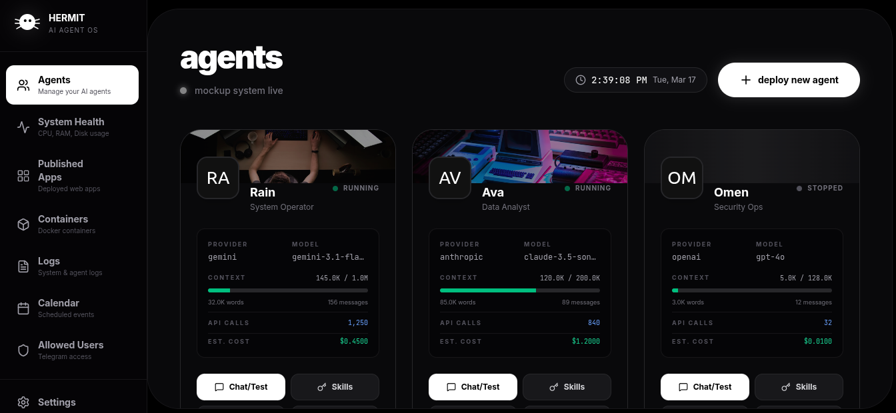
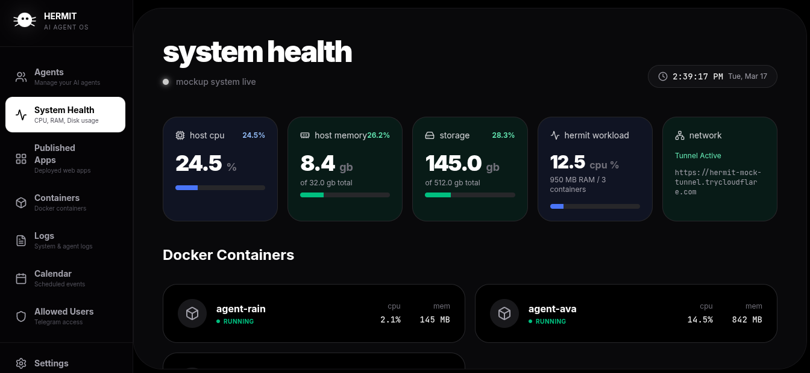

# HermitShell - AI Agent OS

<p align="center">
  
</p>

<p align="center">
  <a href="https://github.com/JohnEsleyer/HermitShell">
    
  </a>
  <a href="https://github.com/JohnEsleyer/HermitShell/releases">
    
  </a>
  <a href="https://github.com/JohnEsleyer/HermitShell/stargazers">
    
  </a>
</p>

<p align="center">
  <b>The Virtual Office of Autonomous AI Agents.</b><br>
  <i>A private, self-contained Operating System for orchestrating and collaborating with your digital workforce.</i>
</p>

---

<p align="center">
  
  
</p>

---

## Overview

HermitShell is more than an orchestrator; it is a **Virtual Office** where your AI agents live, work, and collaborate. Built as a self-contained Operating System, it provides isolated Docker environments for every agent, ensuring absolute privacy and structural integrity. 

Whether they are writing code, managing your calendar, or publishing web applications, your agents operate within a secure "Shell" that you own and control. 

### Core Concepts

- **💼 Digital Workforce**: Treat your AI models as specialized employees with their own persistent workspaces.
- **🛡️ Total Sovereignty**: Your keys, your data, your containers. Everything stays within your private infrastructure.
- **🛠️ Integrated Tools**: Agents have native access to terminal execution, file versioning, and web deployment.
- **📟 Central Command**: A high-end dashboard to monitor pulses, resource usage, and agent health in real-time.

- **🤖 AI Agents**: Autonomous agents with LLM capabilities (OpenAI, Anthropic, Google Gemini, OpenRouter)
- **📦 Containers**: Isolated Docker workspaces for each agent
- **💬 Telegram**: User interaction via Telegram Bot API
- **📅 Scheduler**: Event-driven agent automation with calendar reminders
- **🌐 Web Apps**: Agents can build and publish web applications
- **📊 Dashboard**: Real-time monitoring and control panel

---

## Quick Start

### Automated Installation (Linux)

```bash
# Download and run the installation script
./install.sh
```

### Using Makefile (Recommended)

```bash
# First-time setup (builds Docker image)
make setup

# Run the server
make run
```

### Manual Setup

```bash
# Build the Go server
go build -o hermit-server ./cmd/hermit/main.go

# Build the Docker image for agents
docker build -t hermit-agent:latest .

# Run
./hermit-server
```

Server starts on port 3000:
- Dashboard: http://localhost:3000/
- API: http://localhost:3000/api/

---

## Environment Variables

Create a `.env` file (optional):

```bash
# Server Configuration
PORT=3000
DATABASE_PATH=./data/hermit.db

# API Keys (configure via dashboard Settings panel)
OPENROUTER_API_KEY=sk-or-...
OPENAI_API_KEY=sk-...
ANTHROPIC_API_KEY=sk-ant-...
GEMINI_API_KEY=AIza...
```

### CLI Credentials

```bash
HERMIT_API_BASE=http://localhost:3000
HERMIT_CLI_USER=admin
HERMIT_CLI_PASS=hermit123
```

---

## Architecture

```
HermitShell/
├── cmd/
│   ├── hermit/           # Server implementation
│   └── cli/              # hermitshell CLI implementation
├── internal/
│   ├── api/              # HTTP Handlers (Dashboard, Telegram)
│   ├── cloudflare/       # Cloudflare Tunnel integration (optional)
│   ├── db/               # SQLite database layer
│   ├── docker/           # Docker orchestration (exec, spawn)
│   ├── llm/              # LLM client (OpenAI, Anthropic, Gemini, OpenRouter)
│   ├── parser/           # XML contract parser
│   ├── telegram/         # Bot API and long polling
│   └── workspace/        # File I/O operations
├── dashboard/            # React frontend (Vite + Tailwind)
├── hermit-server        # Main server binary
└── hermitshell          # CLI tool binary
```

---

## Dashboard Panels

| Panel              | Description                                     |
| ------------------ | ----------------------------------------------- |
| **Agents**         | Create, configure, and manage AI agents         |
| **Containers**     | Monitor Docker containers with CPU/Memory stats |
| **System Health**  | Host metrics (CPU, Memory, Disk)                |
| **Published Apps** | Web apps created by agents                      |
| **Settings**       | API keys, timezone, tunnel/domain mode          |
| **Docs**           | Documentation and guides                        |

---

## Agent Workspace

Each agent runs in an isolated Docker container with:
- `/app/workspace/work/` - Scratch work, scripts, generation
- `/app/workspace/in/` - User-provided input files
- `/app/workspace/out/` - Deliverables (files to give to user)
- `/app/workspace/apps/` - Published web apps
- `calendar.db` - Local scheduling database

---

## Telegram Integration

- Long polling for message handling (architectural simplicity)
- Per-agent bot configuration
- User allowlist security
- Commands: `/status`, `/help`, `/clear`, `/reset`, `/takeover`

### Example /status Response

```
🤖 *Agent Status: Rain*

• Model: `gemini-3.1-flash-lite-preview`
• Provider: `gemini`
• Context Window: `1048576` tokens
• LLM API Calls: `42`
• Container: `agent-rain` (Running ✅)
• Connection: Long Polling Active ✅
```

---

## XML Contract Parser

Agents use XML tags for actions:

```xml
<!-- Send message to user -->
<message>Hello! I've completed your task.</message>

<!-- Execute terminal command -->
<terminal>ls -la /app/workspace/work</terminal>

<!-- Send file to user -->
<give>report.pdf</give>

<!-- Create web application files -->
<app name="myapp">
<html>
  <h1>Hello World</h1>
</html>
<style>
  h1 { color: #333; }
</style>
<script>
  console.log('App loaded');
</script>
</app>

<!-- Deploy and publish the app -->
<deploy>myapp</deploy>

<!-- Schedule multiple reminders -->
<calendar>
<datetime>2026-03-17T13:43:25</datetime>
<prompt>Japanese Lesson 1: 'Komorebi' - Sunlight filtering through trees</prompt>
</calendar>
<calendar>
<datetime>2026-03-17T13:45:25</datetime>
<prompt>Japanese Lesson 2: 'Mono no aware' - The pathos of beautiful things</prompt>
</calendar>

<!-- List all calendar events -->
<calendar action="list"/>

<!-- Delete a calendar event -->
<calendar action="delete" id="123"/>

<!-- Update a calendar event -->
<calendar action="update" id="456"><prompt>Updated reminder prompt</prompt></calendar>

<!-- Load skill context -->
<skill>python-coding</skill>

<!-- Request system information -->
<system>time</system>
<system>memory</system>
```

---

## Docker Orchestration

- Auto-create container on agent creation
- Auto-start container on telegram message
- Container reset capability
- Real-time metrics collection

---

## Usage Tracking

Each agent tracks:
- **LLM API Calls**: Number of requests sent to the LLM provider
- **Context Window**: Maximum token limit for the model
- **Word Count**: Total words in conversation history
- **Estimated Cost**: Cumulative cost estimation based on token usage

These metrics are displayed in the agent card on the dashboard and in the `/status` Telegram command.

---

## Makefile Commands

| Command             | Description                             |
| ------------------- | --------------------------------------- |
| `make setup`        | First-time setup (builds Docker image)  |
| `make build`        | Build everything (UI + Server + Docker) |
| `make build-ui`     | Build React dashboard                   |
| `make build-server` | Build Go binary                         |
| `make build-docker` | Build hermit-agent Docker image         |
| `make dev`          | Run in development mode                 |
| `make run`          | Build and run production server         |
| `make clean`        | Remove build artifacts                  |

---

## API Endpoints

| Endpoint                 | Method           | Description                   |
| ------------------------ | ---------------- | ----------------------------- |
| `/api/agents`            | GET, POST        | List/Create agents            |
| `/api/agents/:id`        | GET, PUT, DELETE | Agent CRUD                    |
| `/api/agents/:id/action` | POST             | Start/Stop/Reset container    |
| `/api/agents/:id/stats`  | GET              | Agent statistics              |
| `/api/containers`        | GET              | List containers with stats    |
| `/api/metrics`           | GET              | Host + container metrics      |
| `/api/settings`          | GET, POST        | Get/Set settings              |
| `/api/agents/:id/apps`   | GET              | List agent web apps           |
| `/apps/:id/:name`        | GET              | Serve agent web apps (Public) |
| `/`                      | GET              | Serve dashboard               |

---

## Testing

```bash
go test ./... -v
```

---

## License

MIT
